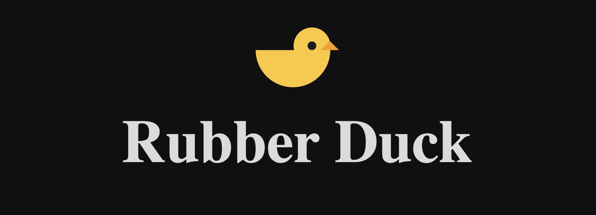

## rubber-duck-client

Developed during a 48-hour hackathon at General Assembly, Rubber Duck is a web application designed to help users practice The Feynman Technique. Users explore topics in their field of expertise and endeavor to convey a clear and succinct explanation of the subject matter. After sharing an explanation, it becomes open to community feedback. Users can then refine their synopsis through multiple iterations, allowing others to observe the evolution of the explanation over time. The application also provides real-time writing feedback and keyword suggestions derived from related posts. You can learn more about the Feynman Technique [here](https://law-hawaii.libguides.com/notetaking/feynman).

> Please note, this is the client app for Rubber Duck. To run the backend server, please visit the [rubber-duck-api](https://github.com/whlong1/rubber-duck-api.git) repository for instructions.

## Getting Started

To run the Rubber Duck client on your local machine, follow these steps:

1. Clone this repository:

    ```bash
    git clone https://github.com/whlong1/rubber-duck-client.git
    ```

2. Navigate to the project directory:

    ```bash
    cd rubber-duck-client
    ```

3. Install the required dependencies:

    ```bash
    npm install
    ```

4. Create a `.env` file in the root directory with the following variables:

    ```
    REACT_APP_BACK_END_SERVER_URL=http://localhost:3001
    ```

5. Start the development server:

    ```bash
    npm start
    ```

6. Open your web browser and navigate to `http://localhost:3000` to access the Rubber Duck web application.

## Technologies Used

- HTML
- CSS
- JavaScript
- Node
- React
- React Router
- Express
- MongoDB
- Mongoose
- React Lottie Player
- MUI

## Credits
This project was made possible thanks to the following technologies:

- React Lottie Player - A package for playing interactive Lottie animations in React. Visit the [React Lottie Player GitHub page](https://github.com/mifi/react-lottie-player) for more information.

- Write Good - A linter for English prose. Visit the [Write Good GitHub page](https://github.com/btford/write-good.git) for more information.
